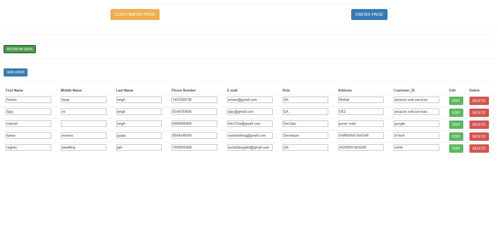
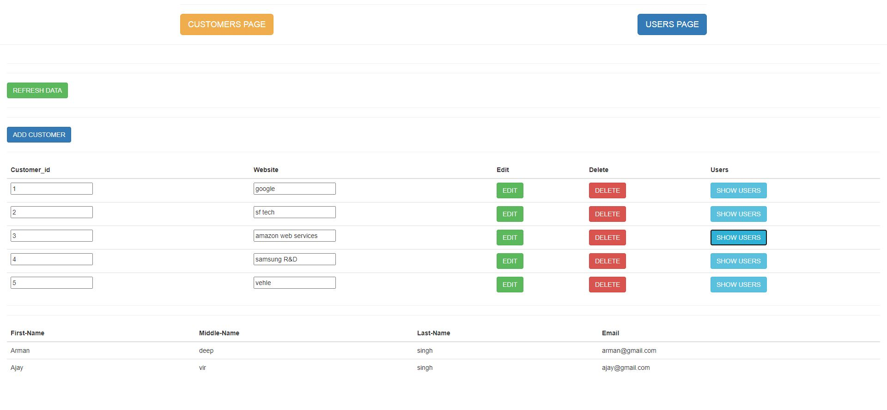

# EMPLOYEE & CUSTOMER DATABASE
This application shows records of various employees and customers.
You can perform ADD,DELETE,EDIT functions on it.
Each employee has a customer and the customers database shows all the customers , also users linked to each customer
Postgres is used to store the data(locally).

# TECHNOLOGIES USED
Postegresql,Node(Express),Angular

# SCREENSHOTS

